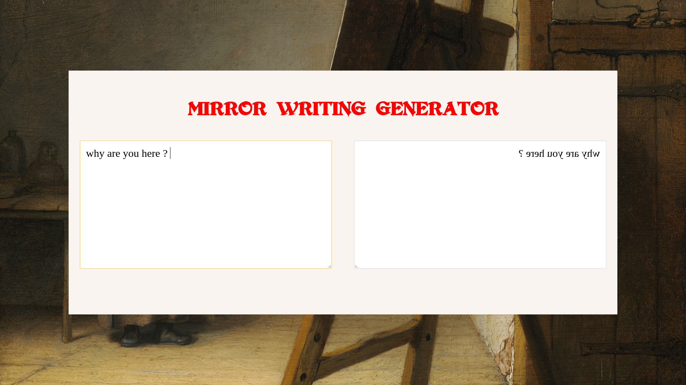

# Mirror writing

Mirror writing has been popularized by Leonardo Da Vinci and consist in writing a text in a way it will be readable only if reflected in a mirror.

# Screenshot



## Getting Started

1. run the development server:

```bash
npm install
npm run dev
```

2. Open [http://localhost:5173](http://localhost:5173/) with your browser.

3. start encrypting your notes/diaries/whatever
